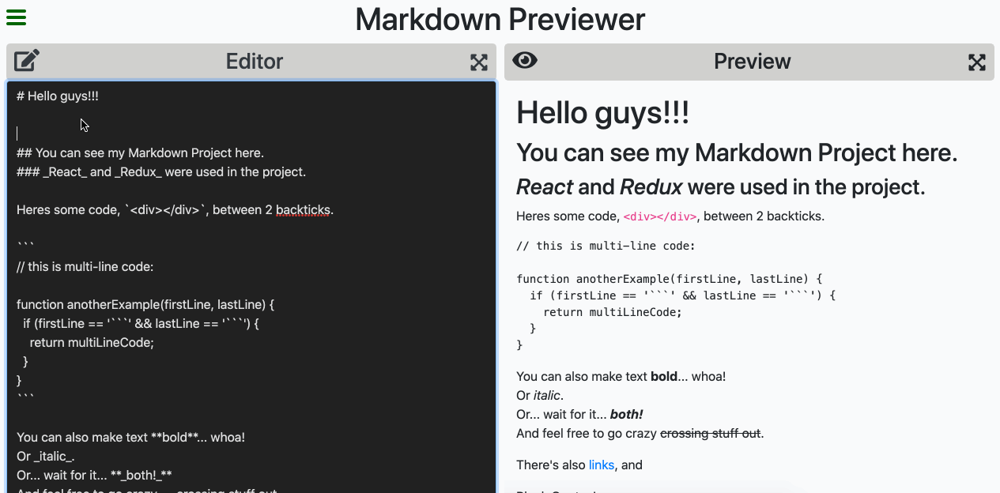

# You can preview the app [here](https://mchtugr.github.io/markdown-previewer/).

# Markdown Previewer

This project is coded for FreeCodeCamp Frontend Libraries Project. You can preview your markdown files live.

## Preview Link

# You can preview the app [here](https://mchtugr.github.io/markdown-previewer/).

## Screenshots



## Run locally

Clone the project

```bash
  git clone https://github.com/mchtugr/markdown-previewer.git
```

Go to project directory

```bash
  cd markdown-previewer
```

Install dependencies

```bash
  npm install
```

Run the app

```bash
  npm run serve
```

## Built with

- ReactJS
- Marked
- Redux
- React Redux
- React Icons

## Contributing

Pull requests are welcome.
For major changes, please open an issue first to discuss what you would like to change.

## License

[MIT](https://choosealicense.com/licenses/mit/)
